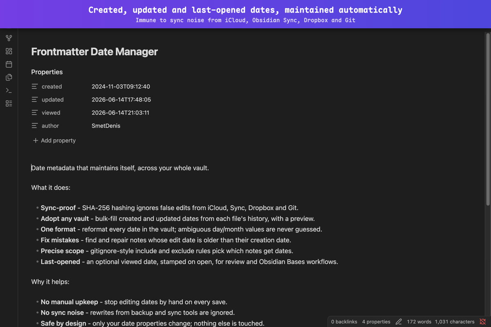
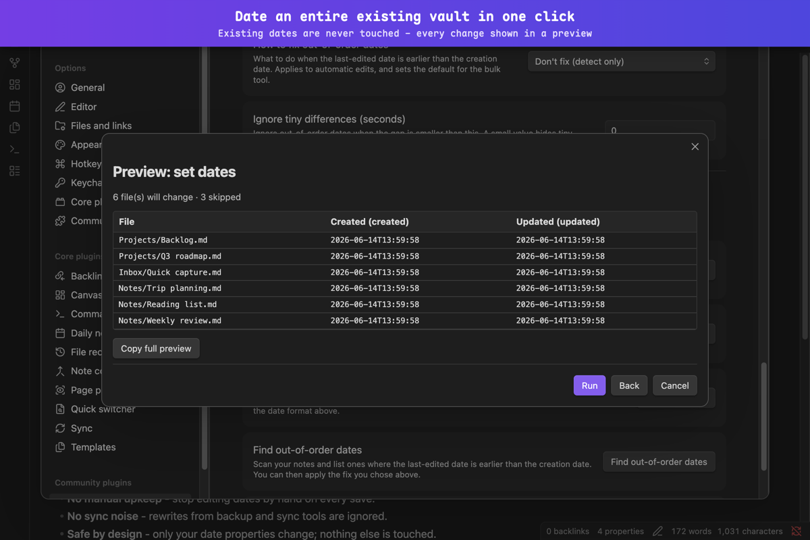
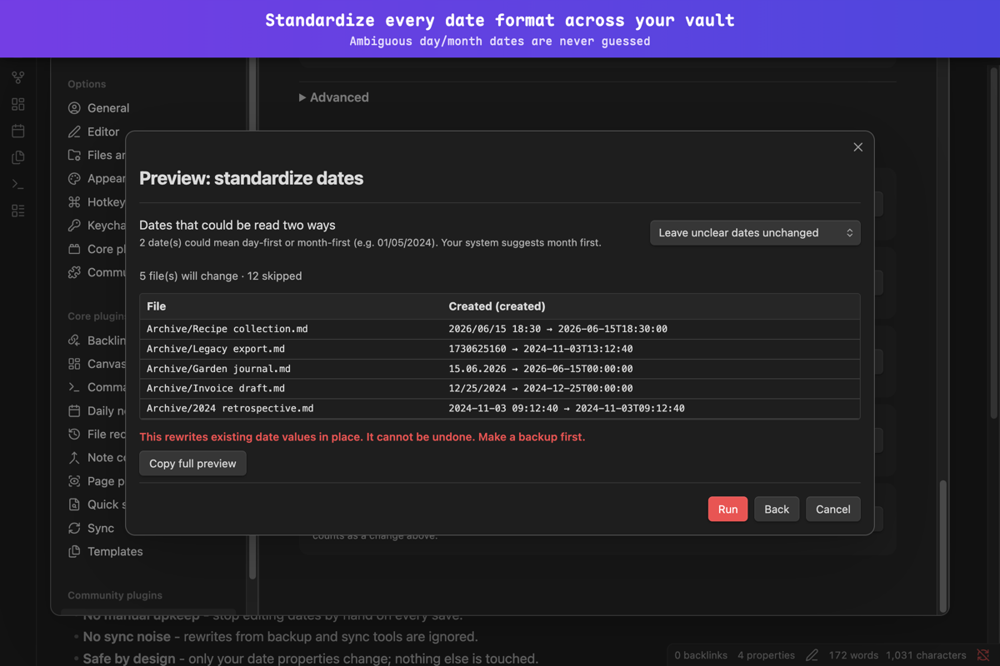
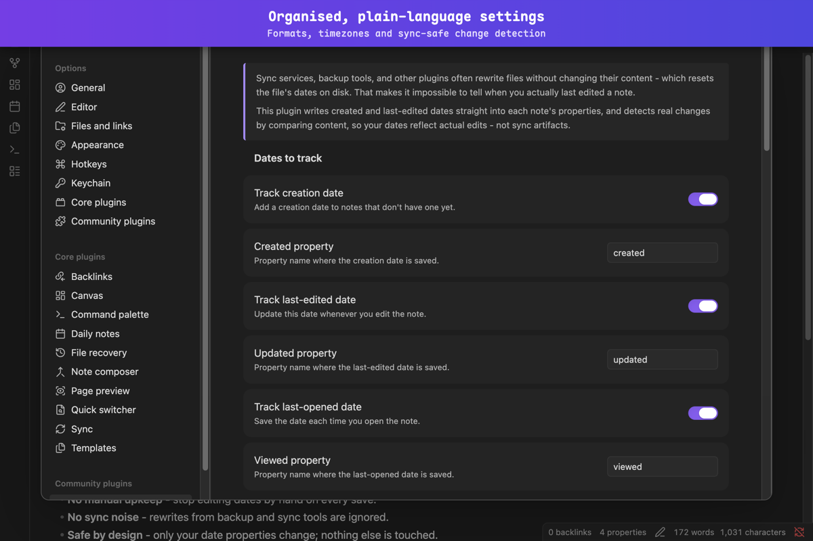
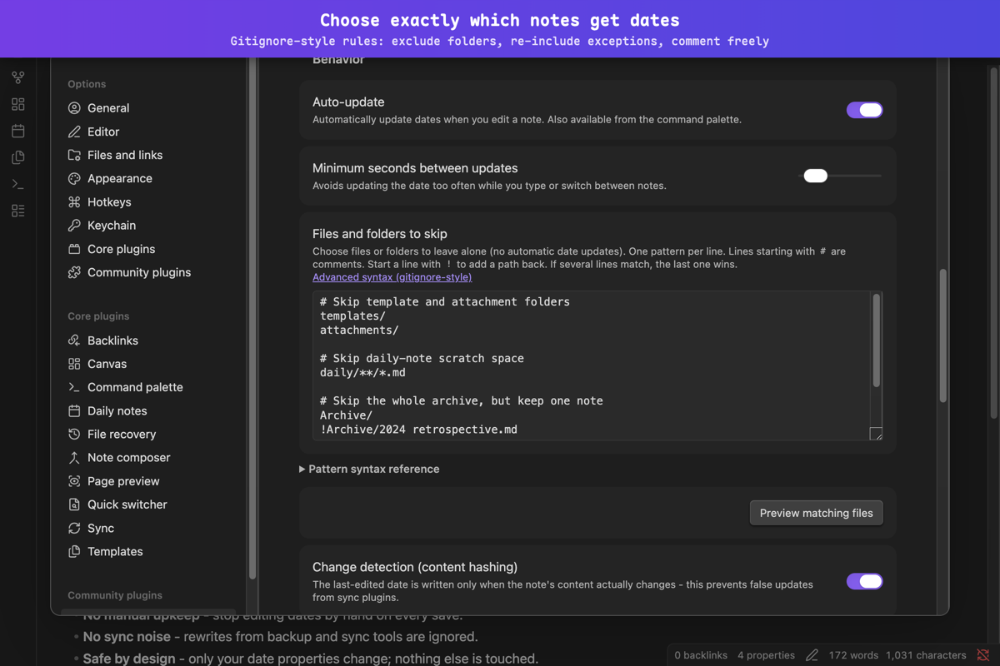

# Obsidian - Frontmatter Date Manager

[](https://github.com/SmetDenis/obsidian-frontmatter-date-manager/actions/workflows/ci.yml)
[](https://github.com/SmetDenis/obsidian-frontmatter-date-manager/releases/latest)
[](https://obsidian.md)
[](https://community.obsidian.md/plugins/frontmatter-date-manager)
[](LICENSE)

Automatically update `created`, `updated`, and `viewed` dates in YAML frontmatter when editing notes in Obsidian.

## Why this plugin?

- **Manual timestamp maintenance is tedious.** Updating `created` and `updated` in frontmatter by hand every time you edit a note is error-prone and breaks your writing flow.
- **Obsidian has no built-in frontmatter date management.** It tracks `ctime`/`mtime` at the filesystem level but doesn't automatically write or maintain date properties inside your notes.
- **Sync tools cause false updates.** Obsidian Sync, iCloud, Syncthing, Dropbox, and Git-based sync modify files without real content changes. Without content hashing, every sync would trigger a timestamp update - creating noise and potentially infinite sync loops.
- **Templates and automation plugins conflict.** Templater, Daily Notes, QuickAdd, and similar plugins create and immediately modify files. Without a configurable delay, timestamps get written before the template is fully applied, resulting in incorrect dates.
- **Existing vaults lack timestamps.** When you adopt the plugin on a vault with hundreds or thousands of notes, you need a way to bulk-populate timestamps from filesystem dates - not update each note one by one.
- **Manual entry leads to inconsistent formats.** Different notes end up with `2024-01-15`, `Jan 15, 2024`, `15.01.2024`, and other variations. The plugin enforces a single configurable format across the entire vault.
- **No automatic "last opened" tracking.** Obsidian tracks when a file was modified but has no concept of when you last *read* it - and no other plugin writes this into frontmatter. This plugin can optionally stamp a `viewed` date every time you open a note, making it queryable via Dataview for spaced repetition, review workflows, and "what haven't I looked at in months?" dashboards.

## Features

- Auto-update `updated` field on file modification (syncs with `mtime`)
- Auto-set `created` field on new files (syncs with `ctime`)
- Auto-set `viewed` field when a file is opened - unique feature not found in other plugins (disabled by default)
- Customizable date format (uses [date-fns](https://date-fns.org/v4.1.0/docs/format) syntax)
- Timezone support with IANA timezone autocomplete
- String and number property types (number useful for Unix timestamps)
- Gitignore-style file filter rules with preview and validation
- Configurable minimum interval between updates
- Delay for newly created files (compatibility with Templater, Daily Notes, etc.)
- SHA-256 content hashing to detect real changes (prevents false updates from sync tools)
- Change detection mode: note body only, properties only, or both
- Property exclusion from change detection
- Run a command after dates are updated
- Bulk-fill dates from each file's own dates on disk, with dry-run preview
- Rename a property across all notes (migrate old names with preview)
- Reformat existing dates from one format to another (parse old, write new, with preview)
- Every bulk preview is paginated (Prev/Next), shows all affected files (no row cap), and can copy the full diff to the clipboard
- Toggle auto-update via command palette or status bar
- Pause auto-update for 5 minutes with automatic resume
- Works on desktop and mobile

## Screenshots











## Installation

### Community plugins

In Obsidian, open Settings > Community plugins > Browse, search for **Frontmatter Date Manager**, and click Install.

### Manual installation

Download `main.js`, `manifest.json`, and `styles.css` from the
[latest release](https://github.com/SmetDenis/obsidian-frontmatter-date-manager/releases/latest)
into `<vault>/.obsidian/plugins/frontmatter-date-manager/`.

## Usage

The plugin runs automatically after installation. When you edit a markdown file, it updates the `updated` property with the current modification time. If the `created` property is missing, it sets it to the file's creation time. Optionally, enable the `viewed` date in settings to record when you last opened each note.

Configure behavior in **Settings -> Frontmatter Date Manager**.

### Commands

| Command                                | Description                                             |
|----------------------------------------|---------------------------------------------------------|
| **Update timestamps for current file** | Manually trigger a timestamp update for the active note |
| **Toggle auto-update on/off**          | Enable or disable automatic timestamp updates           |
| **Pause auto-update for 5 minutes**    | Temporarily pause updates with automatic resume         |

**Status bar indicator** - shows current state (`Paused` or `Paused (Xm)`); click to toggle auto-update on/off.

## Settings

| Setting                            | Default                 | Description                                                                      |
|------------------------------------|-------------------------|----------------------------------------------------------------------------------|
| Track creation date                | `true`                  | Add a creation date to notes that don't have one yet                             |
| Created property                   | `created`               | Property name where the creation date is saved                                   |
| Track last-edited date             | `true`                  | Update this date whenever you edit the note                                      |
| Updated property                   | `updated`               | Property name where the last-edited date is saved                                |
| Track last-opened date             | `false`                 | Save the date each time you open the note                                        |
| Viewed property                    | `viewed`                | Property name where the last-opened date is saved                                |
| Date format                        | `yyyy-MM-dd'T'HH:mm:ss` | Date & time format ([date-fns syntax](https://date-fns.org/v4.1.0/docs/format))  |
| Timezone                           | `""` (system)           | IANA timezone identifier; empty uses the system timezone                         |
| Save number-only dates without quotes | `false`              | Output numbers instead of quoted text for digit-only formats                     |
| Auto-update                        | `true`                  | Automatically update dates when you edit a note                                  |
| Minimum seconds between updates    | `30`                    | Minimum interval between date updates                                            |
| Files and folders to skip          | `""` (all files)        | Gitignore-style rules: lines exclude, `!` re-includes, `#` comments              |
| Change detection (content hashing) | `true`                  | Write the date only when content actually changes (SHA-256 hashing)             |
| What counts as a change            | `body`                  | What triggers updates: `body`, `frontmatter`, or `both`                          |
| Ignore these properties            | `[]`                    | Properties to ignore in change detection; add several at once, comma-separated   |
| New file delay                     | `5000` ms               | Wait before processing newly created notes                                       |
| Auto-populate cache on startup     | `true`                  | Build change-detection data for uncached notes when the plugin loads             |
| Maximum cache entries              | `10000`                 | Oldest unused entries are removed when the cache exceeds this limit              |
| Command after update               | `""` (none)             | Obsidian command to run after each date update                                   |

### Modified-before-created dates

| Setting                          | Default    | Description                                                                                                                       |
|----------------------------------|------------|----------------------------------------------------------------------------------------------------------------------------------|
| `How to fix out-of-order dates`  | `disabled` | What to do when the last-edited date is earlier than the creation date. Applies to automatic edits; `disabled` means detect-only. |
| `Ignore tiny differences (seconds)` | `0`     | Ignore out-of-order dates when the gap is smaller than this. Useful to suppress sub-second clock skew.                            |
| `Find out-of-order dates`        | _(action)_ | Scans your notes (respects skip rules) and lists ones where the last-edited date is earlier than the creation date. Apply the fix in the modal. |

Available strategies: `Set creation date to the last-edited date`, `Set last-edited date to the creation date`, `Set both to the most recent date`.

## Date format examples

| Format string           | Example output            |
|-------------------------|---------------------------|
| `yyyy-MM-dd'T'HH:mm:ss` | 2026-04-12T14:30:00       |
| `yyyy-MM-dd HH:mm:ss`   | 2026-04-12 14:30:00       |
| `dd.MM.yyyy HH:mm`      | 12.04.2026 14:30          |
| `t`                     | 1776268200 (Unix seconds) |
| `T`                     | 1776268200000 (Unix ms)   |

> **Note:** This plugin uses **date-fns**, not Moment.js. Common migration: `YYYY` -> `yyyy`, `DD` -> `dd`.

## FAQ

### First installation

> Will the plugin modify all my existing notes when I first enable it?

No. The plugin only processes a file when you edit it. On first load it builds a background hash cache of your existing files to prepare for change detection, but it never writes timestamps during this process. Your vault stays untouched until you actually edit a note.

> How do I add timestamps to notes I wrote before installing?

Use Settings → Bulk operations → Set dates from the file's own dates. It reads each file's own creation and modification dates on disk and writes them into your note's properties, with a dry-run preview so you can review before committing. Default mode is "Fill missing only" - existing dates are not overwritten. If your vault syncs via iCloud or Obsidian Sync, those on-disk dates may have been reset by the sync service - review the preview carefully.

> I use Templater / Daily Notes / QuickAdd. Will the plugin conflict with them?

No. The plugin waits 5 seconds (configurable: Settings → Behavior → Advanced → New file delay) before processing newly created files, giving template plugins time to finish.

> Do I need to add properties to every note manually first?

No. If a note has no properties yet, the plugin creates the `---` block and inserts the dates on the next edit. If properties already exist, it adds the date properties alongside your existing ones.

> What date format works best with Dataview?

The default `yyyy-MM-dd'T'HH:mm:ss` (ISO 8601) works out of the box. Dataview can parse, sort, and compare it natively.

> The plugin uses date-fns, not Moment.js. Does that affect me?

Only if you customize the date format. Key difference: use `yyyy` (not `YYYY`) for year, `dd` (not `DD`) for day. The plugin shows a hint in settings if it detects a Moment.js-style format.

### Everyday usage

> I enabled "viewed" timestamps but they don't appear in some notes.

The viewed timestamp is only written when you open a file. Notes you haven't opened since enabling the feature won't have the field yet. The same filter rules and minimum-interval setting apply to viewed writes.

> I edited tags or aliases, but `updated` didn't change. Is that a bug?

No. By default, change detection only looks at the note body - only changes below the properties block trigger a date update. To include property changes, switch Settings → Change detection → What counts as a change to "Both".

> Will syncing (iCloud / Obsidian Sync / Dropbox) cause false timestamps?

No. The plugin compares file content via SHA-256 hashing. If a sync service rewrites a file without changing its content, the hash matches and no timestamp is updated. Enabled by default.

> I renamed or moved a note. Does the plugin lose track of it?

No. The hash cache entry is automatically migrated to the new path. Existing timestamps are preserved.

> I changed the date format. Will old timestamps be converted?

Not automatically. Use Settings → Bulk operations → Reformat dates to standardize all values. The plugin auto-detects existing formats (ISO 8601, European, US, numeric timestamps) and rewrites them using your current format. Preview all changes before applying.

> A date like `01/05/2024` could mean January 5 or May 1. What happens?

Such ambiguous day/month dates are left unchanged by default - the plugin never guesses. The preview shows how many were found and offers a one-click choice (day first or month first), pre-suggested from your system region, so you decide before anything is rewritten. Dates with only one valid reading (e.g. `25/12/2024`) are always converted.

> I renamed the property (e.g. `created` → `date_created`). What about existing files?

Use Settings → Bulk operations → Rename property. Enter the old and new property names, preview affected notes, then apply. You can choose whether to delete the old property or keep both.

> I changed the timezone. Will old timestamps be recalculated?

No. Same principle - old values are left untouched. New writes use the new timezone.

> What happens if a note has broken YAML frontmatter?

The plugin skips that file and shows a notice with the file path and error details. It never writes to a file with malformed YAML. Fix the syntax and the plugin will pick it up on the next edit.

> I'm saving rapidly. Will the timestamp update on every save?

No. There is a minimum 30-second interval between updates (configurable: 5-300 seconds) plus a 2-second debounce, so rapid edits are consolidated into a single timestamp write.

## Sync and version control

The plugin stores a local cache file `hash-cache.json` inside its data directory (`.obsidian/plugins/frontmatter-date-manager/`). This file contains SHA-256 hashes used for content change detection. It rebuilds automatically on startup, so excluding it is safe and recommended.

**Why exclude:** the cache updates on every file edit, so multiple devices modify it independently - causing frequent sync conflicts and unnecessary traffic. Since it rebuilds automatically, syncing provides no benefit.

Add to your `.gitignore`:

```
.obsidian/plugins/frontmatter-date-manager/hash-cache.json
```

For **Obsidian Sync**: the file is already excluded automatically (Sync does not sync plugin data files beyond `data.json`).

For **iCloud, Syncthing, Dropbox, or other file-based sync**: add `hash-cache.json` to your sync tool's ignore/exclusion list for the plugin directory.

## Development

```bash
make              # Show all available commands
make install      # Install dependencies
make pre-commit   # Run all checks (format, lint, test, build)
make local-test   # Build and copy plugin to local vault
```

To use `make local-test`, set `OBSIDIAN_VAULT_TEST` in your shell environment, or pass it directly: `make local-test OBSIDIAN_VAULT_TEST=/path/to/vault`.

## License

[MIT](LICENSE)
